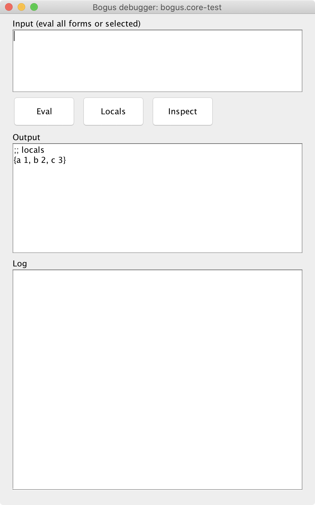
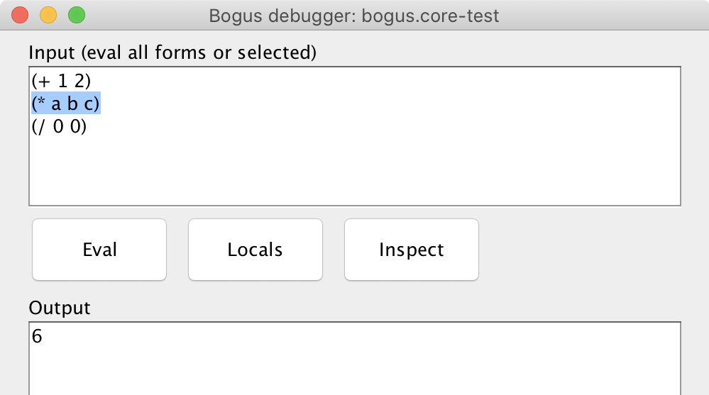
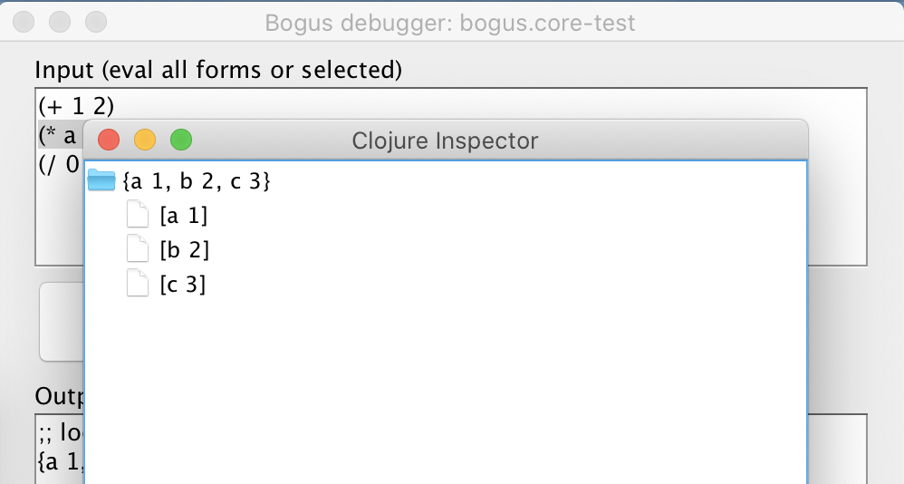
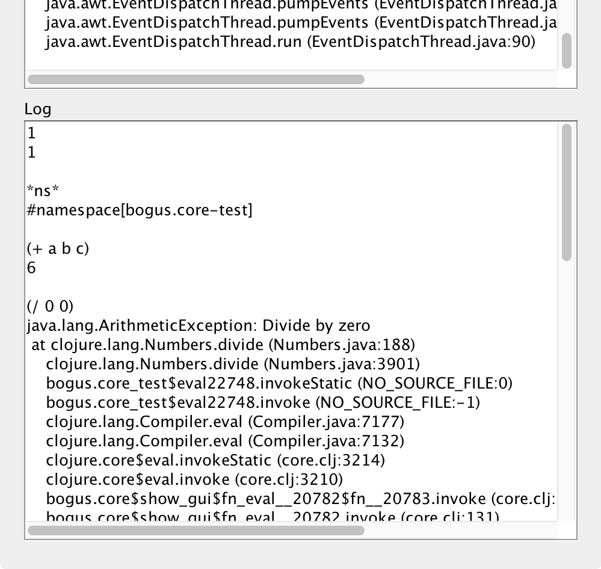
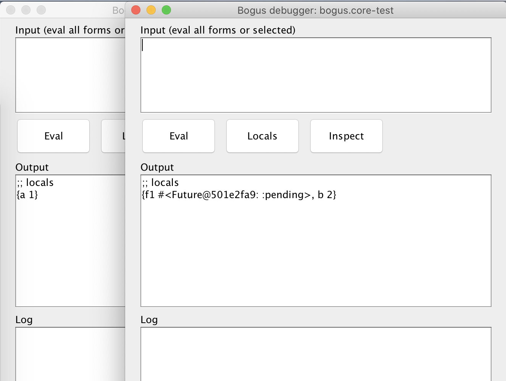

# Bogus

[NIH]: https://en.wikipedia.org/wiki/Not_invented_here

A small, GUI-powered, [NIH][NIH]-reasoned debugger for Clojure.

## Installation

Lein:

```clojure
[com.github.igrishaev/bogus "0.1.0"]
```

Deps.edn

```clojure
{com.github.igrishaev/bogus {:mvn/version "0.1.0"}}
```

The best way to use Bogus is to setup it locally in your `profiles.clj` file:

```clojure
;; ~/.lein/profiles.clj

{:user
 {:dependencies [[com.github.igrishaev/bogus "0.1.0"]]
  :injections [(require 'bogus.core)]}}
```

## Usage

Once you have the dependency added and the `bogus.core` namespace imported,
place one of these two forms into your code:

```clojure
(bogus.core/debug)
;; or
#bg/debug
```

For example:

```clojure
(defn do-some-action []
  (let [a 1
        b 2
        c (+ a b)]
    #bg/debug ;; or (bogus.core/debug)
    (+ a b c)))
```

Now run the function, and you'll see the UI:



The UI window blocks execution of the code. In the example above, you'll hang
right before executing the next `(+ a b c)` form. Close the window to continue
execution of the code.

The UI consists from three parts: the input area, the output, and the log. Type
any Clojure-friendly form in the input textarea and press "Eval". The result
will take place in the output textarea. You can copy it from there to your
editor.

The input can take many Clojure forms at once. They are executed as follows:

```clojure
(eval '(do (form1) (form2) ...))
```

so you'll get the result of the last one.

If you mark some text in the input with selection, only this fragment of code
will be executed.



In the input code, you can use any local variables as they're global ones. In the
example above we've executed the `(+ a b c)` form referencing local `a`, `b`,
and `c` from the `let` clause.

The "Locals" button pretty-prints the local variables. Bogus does it in advance
when the window opens the first time. The "Inspect" button opens the standard
`clojure.inspector/inspect-tree` widget rendering the locals. This is quite
useful when examining massive chunks of data.



The Log area tracks the history of the expressions you executed and their
results. That's useful sometimes to copy-paste it somewhere. Should you get an
exception, it gets rendered with the `clojure.stacktrace/print-stack-trace`
function (which probably needs some improvements).



You can have several debug breakpoints, for example:

```clojure
(defn do-some-action []
  (let [a 1
        b 2
        c (+ a b)]
    #bg/debug
    (+ a b c)
    (let [d 9]
      #bg/debug
      (* a b c d))))
```

The first debug session will take the `a`, `b`, and `c` locals, whereas the
second one will have `a`, `b`, `c`, and `d`. You won't proceed to the second
session until you close the first window.

Bogus debugger works in tests, in nREPL, in ordinary REPL, in Manifold, in the
futures as well. Here is a small demo of having two debug sessions in parallel
threads:

```clojure
(let [f1 (future
           (let [a 1]
             #bg/debug
             (+ a 1)))
      f2 (future
           (let [b 2]
             #bg/debug
             (+ b 1)))]
  (+ @f1 @f2))
```

If you run this code, you'll get the two windows each having their own locals:



The second session has the `f1` local var captured from the `let` clause. If you
try to `deref` it, the entire REPL will hang due to the mutual blocking, so be
careful when dealing with parallel debugging.

## How it works

The under-hood of Bogus is simple: it captures the local vars from the `&env`
mapping available in a macro. Then there is a couple of functions that
"globalize" the locals by injecting them into the origin namespace using
`clojure.core/intern`. Once the namespace is populated, the `eval` form treats
local vars as globals. Before leaving the macros, the vars are "deglobalized"
meaning all the injected vars are removed. The macros is smart enough to
preserve existing global vars: it temporary assigns them another name like
`__OLD_my-var__`.

## Why

The idea of making my own debugger came into my mind while I was writing a new
chapter about nREPL and code evaluation. Although Cider provides much more
powerful tools for debugging, I still believe Bogus might be useful for someone
new to Clojure. The main benefit of Bogus is, it doesn't require the whole nREPL
stuff and Emacs. One can use it with any editor or environment. After all,
tinkering with Bogus gave me some good material for the book.

## Other

Copyright &copy; 2022 Ivan Grishaev
